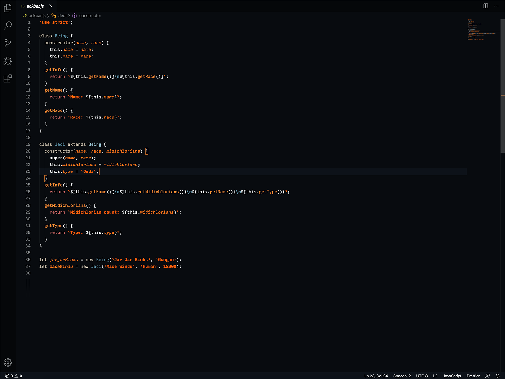
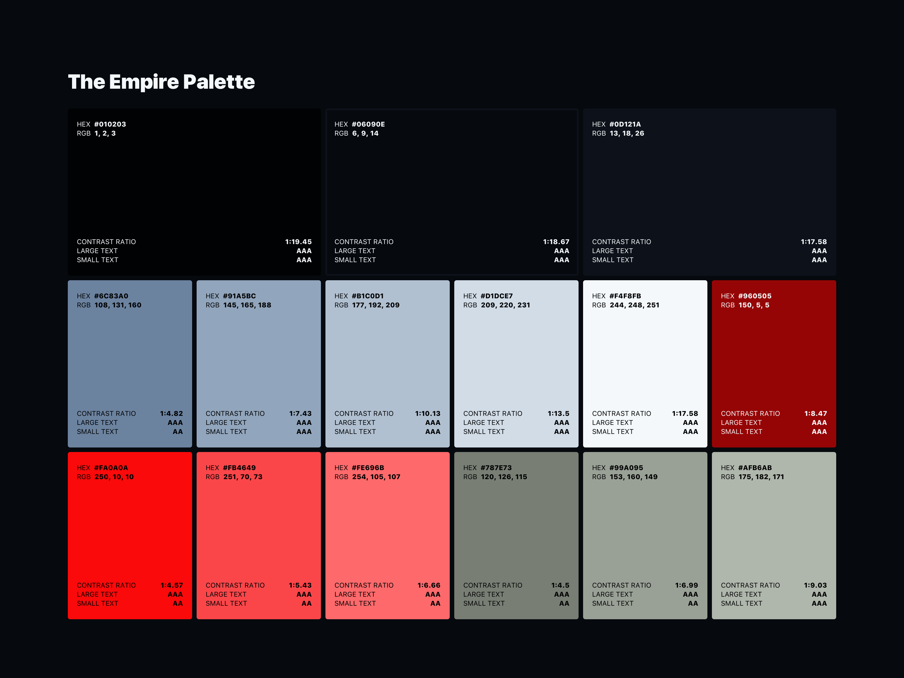
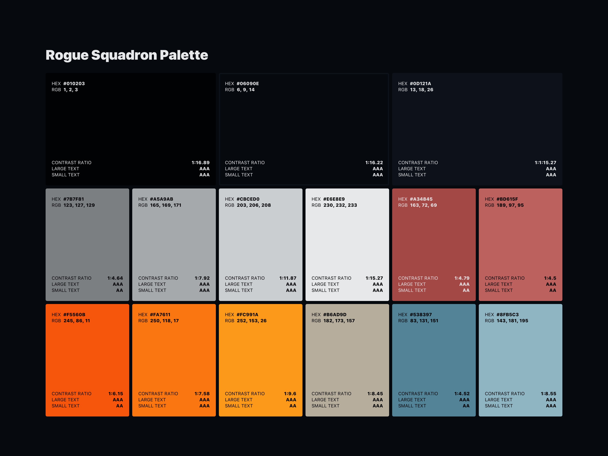

# A theme for Visual Studio Code from a galaxy far, far away...



The aim of this project is to provide users with a theme for Visual Studio Code from a galaxy far, far away...

## Installation

To install this theme, follow these steps:

1. Launch Visual Studio Code
2. Press `cmd + p` if you're running Mac OS, or `ctrl + p` if you're running Windows OS to open the _Command Palette_
3. Paste `ext install a-galaxy-far-far-away-theme` into the _Command Palette_ and press `return`
4. Click `Install` on the extension, in the _Extensions_ panel
5. Select the theme you would like to use, from the two that are available:

- The Empire
- Rogue Squadron

Alternatively, you can install this theme from the _Extensions_ panel by searching for
`A Galaxy Far, Far Away Theme` or from the [Visual Studio Code Marketplace](https://marketplace.visualstudio.com/items?itemName=DanMad.a-galaxy-far-far-away-theme).

## Recommended settings

If you'd like to use this theme exactly as intended, copy & paste the recommended settings below into VSCode's settings.json file.

```javascript
{
  "editor.autoIndent": "full",
  "editor.cursorSmoothCaretAnimation": true,
  "editor.cursorWidth": 1,
  "editor.fontFamily": "Input Mono, Inconsolata, monospace",
  "editor.fontLigatures": true,
  "editor.fontSize": 12,
  "editor.fontWeight": "400",
  "editor.formatOnPaste": true,
  "editor.formatOnSave": true,
  "editor.lineHeight": 24,
  "editor.letterSpacing": -0.1,
  "editor.minimap.enabled": false,
  "editor.snippetSuggestions": "top",
  "editor.tabCompletion": "on",
  "editor.tabSize": 2,
  "editor.renderWhitespace": "all",
  "editor.wordWrap": "on",
  "terminal.integrated.fontFamily": "Input Mono, Inconsolata, monospace",
  "workbench.colorCustomizations": {},
  "workbench.colorTheme": "Rogue Squadron",
  "workbench.fontAliasing": "antialiased",
  "workbench.iconTheme": "vs-minimal",
  "workbench.startupEditor": "newUntitledFile",
}
```

## Font

The font used in the theme examples is [Input Mono](https://input.fontbureau.com), which is free for **personal use**. See the font's [license](https://input.fontbureau.com/license/) for more information.

## Information

The color palette of this theme has been carefully chosen to reflect various galactical movements, while meeting [WCAG 2.1, Level AA Compliance Guidelines](https://www.w3.org/TR/WCAG21/).





This theme currently supports the following languages:

- CSS
- HTML
- JavaScript
- JSON
- JSX
- Markdown
- Sass (SCSS)
- TypeScript
- XML

## Issues

If you encounter any bugs, please [post an issue](https://github.com/DanMad/a-galaxy-far-far-away-theme/issues).

## Contributing

Contributions are more than welcome. Ensure you read through the [contributing guidelines](https://github.com/DanMad/a-galaxy-far-far-away-theme/blob/release/v1.0.0/CONTRIBUTING.md) before submitting a pull request.
